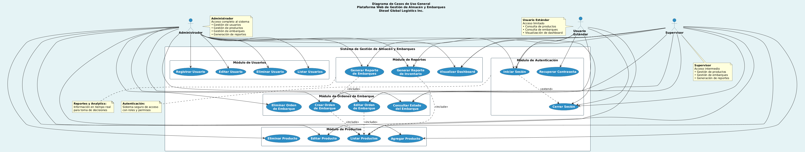
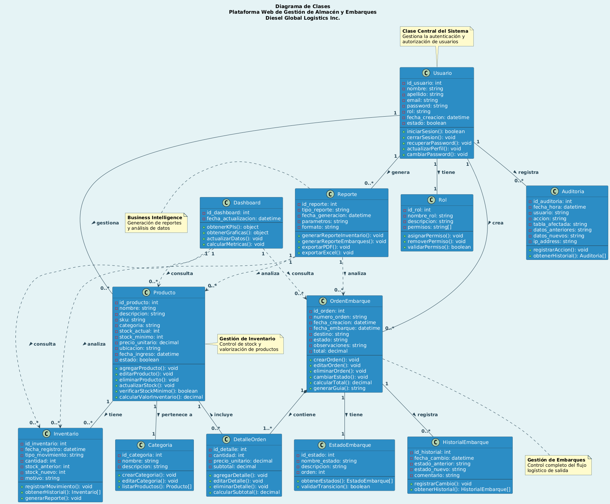
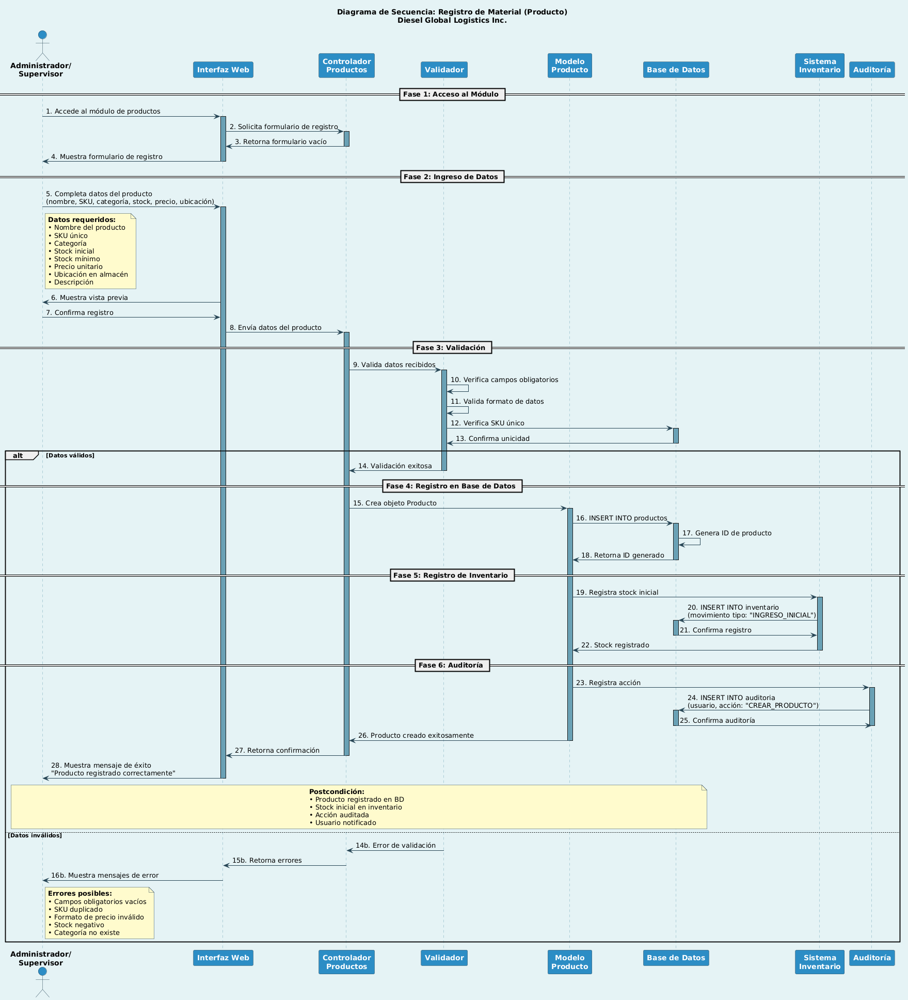
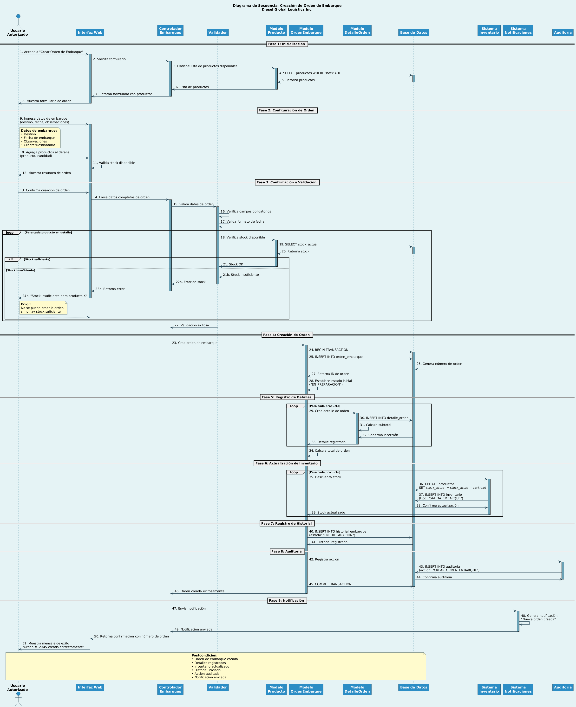
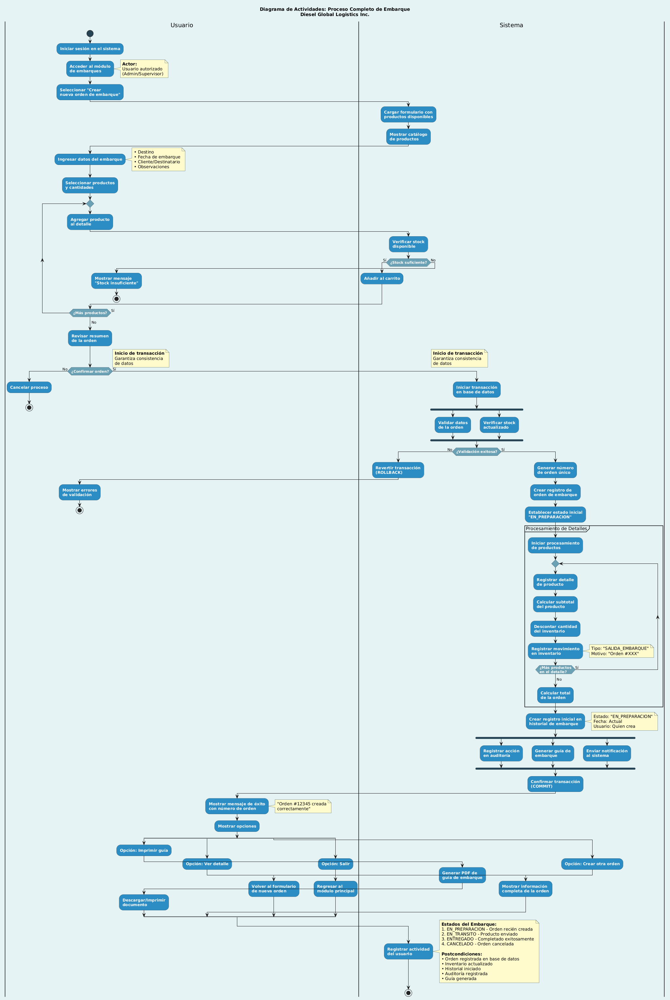

# 📐 Diagramas UML

Este documento presenta los diagramas UML de la **Plataforma Web de Gestión de Almacén y Embarques – Diesel Global Logistics Inc.**

Los diagramas se representan mediante imágenes para una mejor visualización. Se incluyen diagramas de:

- Casos de Uso
- Clases
- Secuencia
- Actividades

---

## 👤 1. Diagrama de Casos de Uso

Este diagrama muestra la interacción entre los actores del sistema y las funcionalidades principales.

📌 **Imagen:**

  

---

## 📦 2. Diagrama de Clases

Representa la estructura del sistema mostrando las clases principales y sus relaciones.

📌 **Imagen:**

  

---

## 🔄 3. Diagrama de Secuencia – Registro de Material

Muestra el flujo de interacción entre el usuario, la interfaz, la API y la base de datos para el registro de materiales.

📌 **Imagen:**

  

---

## 🔄 4. Diagrama de Secuencia – Creación de Embarque

Representa el proceso de creación de una orden de embarque.

📌 **Imagen:**

  

---

## 🔁 5. Diagrama de Actividades – Proceso de Embarque

Muestra el flujo de actividades desde la creación hasta la validación de un embarque.

📌 **Imagen:**

  

[← Volver al Diseño del Sistema](index)

