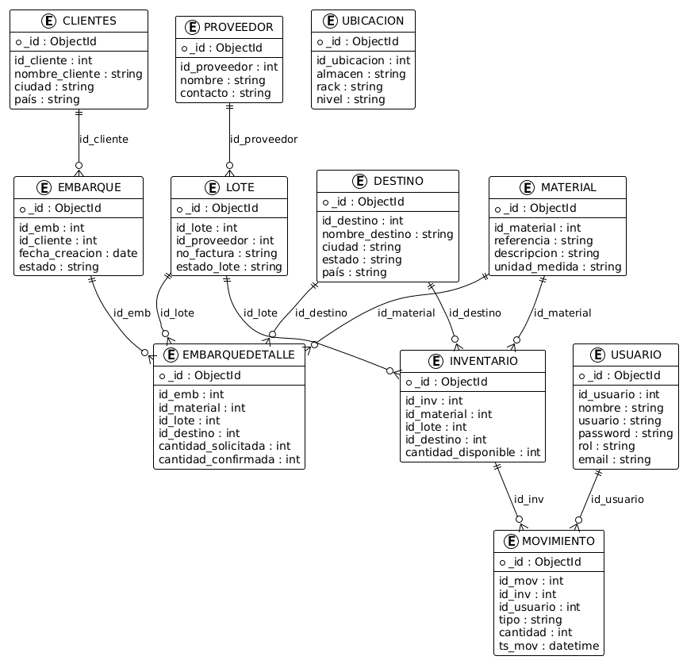

# 🧾 Informe Técnico de Diseño del Sistema  
**Proyecto:** Plataforma Web de Gestión de Almacén y Embarques  
**Empresa:** Diesel Global Logistics Inc.  
**Versión del documento:** 1.0  
**Fecha:** 2025

---

## 1. Introducción

El presente documento tiene como objetivo describir de forma detallada el **diseño técnico, arquitectónico y estructural del sistema de gestión de almacén y embarques**, desarrollado para la empresa **Diesel Global Logistics Inc.**

El sistema está orientado a la administración eficiente de inventarios, control de lotes, embarques y trazabilidad logística mediante tecnologías web modernas. Este informe documenta los principales lineamientos de diseño, arquitectura de datos, decisiones técnicas y justificaciones tecnológicas para garantizar un sistema escalable, seguro y mantenible.

---

## 2. Equipo de Diseño

El diseño del sistema fue elaborado por los siguientes integrantes:

- **Luis Fernando Loma Navarrete** – Diseñador UX/UI  
- **María Alondra Ortiz Benítez** – Diseñadora UX/UI

  

---

## 3. Contexto del Sistema

La plataforma fue diseñada para resolver problemáticas reales detectadas en los procesos manuales y semiautomatizados de la empresa, tales como:

- Errores humanos en el registro de inventarios  
- Falta de trazabilidad en movimientos  
- Dificultad para auditar lotes  
- Lentitud en generación de reportes  
- Dependencia de hojas de cálculo no centralizadas  

El sistema propone una **plataforma web centralizada** que digitaliza estos procesos y automatiza tareas clave.

---

## 4. Objetivos del Diseño

Los objetivos principales perseguidos en el diseño del sistema fueron:

- Crear una arquitectura modular y escalable  
- Permitir el procesamiento en tiempo real de operaciones  
- Garantizar seguridad de la información  
- Facilitar mantenibilidad y evolución futura  
- Asegurar una experiencia de usuario intuitiva  

---

## 5. Requerimientos Técnicos del Sistema

El diseño técnico contempla:

- Usuarios simultáneos: mínimo 50 concurrentes  
- Tiempo de respuesta objetivo: < 3 segundos  
- Disponibilidad: 99.5%  
- Integración con sistemas futuros (ERP, IoT, sensores)  
- Manejo de códigos QR para trazabilidad  

---

## 6. Justificación de la Arquitectura NoSQL

Para la capa de datos se seleccionó **MongoDB**, una base de datos NoSQL orientada a documentos, debido a los siguientes motivos:

### 6.1 Esquema Flexible

MongoDB permite:

- Adaptar estructuras de datos conforme evoluciona el negocio  
- Agregar nuevos campos sin migraciones pesadas  
- Flexibilidad ante cambios frecuentes de requerimientos  

### 6.2 Rendimiento

MongoDB ofrece:

- Altas velocidades de inserción (ideal para escaneos QR)  
- Lecturas optimizadas mediante índices  
- Reducción de latencia en consultas repetidas  

### 6.3 Escalabilidad

El sistema está preparado para crecer usando:

- Sharding (fragmentación de datos)  
- Replicación de nodos  
- Balanceo de carga  

---

## 7. Arquitectura General del Sistema

La arquitectura del sistema se divide en tres capas principales:

### 7.1 Capa de Presentación

- Framework frontend moderno (React/Vue)  
- Consumo de API REST  
- Interfaz responsiva  

### 7.2 Capa de Lógica de Negocio

- API REST desarrollada en Node.js  
- Controladores por módulo  
- Validaciones de negocio  
- Sistema de autenticación JWT  

### 7.3 Capa de Datos

- MongoDB como motor principal  
- Índices optimizados  
- Mecanismos de respaldo  

---

## 8. Colecciones Definidas en MongoDB

Las principales colecciones utilizadas en el sistema son:

| Colección | Descripción |
|----------|------------|
| materiales | Catálogo de productos |
| proveedores | Datos de proveedores |
| clientes | Información de clientes |
| destinos | Ubicaciones de entrega |
| lotes | Control de lotes |
| inventarios | Cantidades por lote |
| movimientos | Historial de entradas/salidas |
| embarques | Encabezado de embarques |
| embarques_detalle | Detalle de productos |
| usuarios | Control de acceso |

---

## 9. Modelo Conceptual de Datos

El sistema está basado en un modelo de trazabilidad completa:

- Un **cliente** puede tener múltiples **destinos**  
- Un **embarque** pertenece a un cliente  
- Un embarque tiene múltiples materiales  
- Cada movimiento queda registrado en **movimientos**  

---

## 10. Diseño de Seguridad

El diseño del sistema integra un enfoque **Security by Design**:

- Autenticación mediante JWT  
- Cifrado HTTPS  
- Hash de contraseñas (bcrypt)  
- Control de roles y permisos (RBAC)  
- Registros de auditoría  

---

## 11. Normativas Aplicadas en el Diseño

### 11.1 ISO/IEC 9241-110

Aplicada para:

- Claridad de interfaz  
- Control del usuario  
- Prevención de errores  
- Facilidad de aprendizaje  

### 11.2 ISO/IEC 9241-151

Aplicada para:

- Navegación web  
- Estructura visual  
- Usabilidad general  

### 11.3 WCAG 2.1

Aplicada en:

- Contraste visual  
- Accesibilidad de formularios  
- Navegación por teclado  

---

## 12. Lineamientos de Interfaz

### 12.1 Diseño Visual

- Interfaz limpia  
- Jerarquía visual clara  
- Uso de colores institucionales  

### 12.2 Componentes UI

- Botones con feedback visual  
- Formularios con validación inmediata  
- Tablas dinámicas  
- Paneles tipo dashboard  

---

## 13. Ventajas Técnicas del Diseño Propuesto

✔ Escalabilidad  
✔ Flexibilidad de datos  
✔ Preparado para integración futura  
✔ Alta disponibilidad  
✔ Experiencia de usuario optimizada  

---

## 14. Riesgos Técnicos Considerados

Durante el diseño se consideraron riesgos como:

- Sobrecarga del sistema  
- Fallas de red  
- Inyección de código  
- Pérdida de información  
- Ataques de fuerza bruta  

Y se definieron medidas preventivas.

---

## 15. Conclusiones

El diseño desarrollado proporciona una base sólida para el crecimiento de la plataforma, soportando:

- Crecimiento progresivo  
- Integraciones futuras  
- Adaptabilidad al negocio  
- Cumplimiento normativo  

Este informe representa la base técnica sobre la cual se desarrolló y desplegó el sistema.

---

  <small>Última actualización: 06 de diciembre de 2025</small> 
  <small>© 2025 Diesel Global Logistics Inc.</small>

