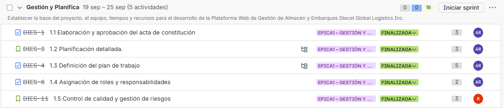
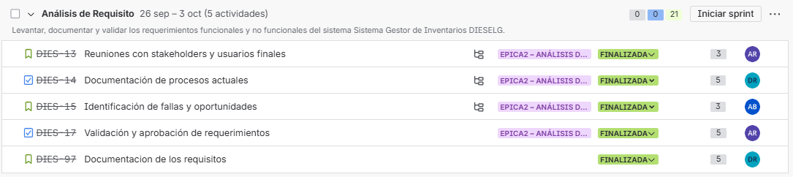
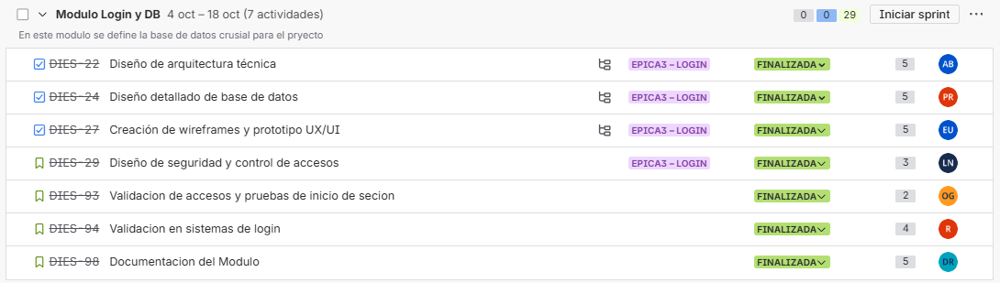
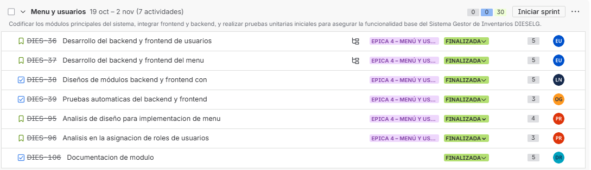
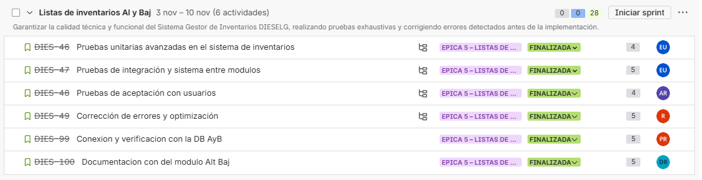
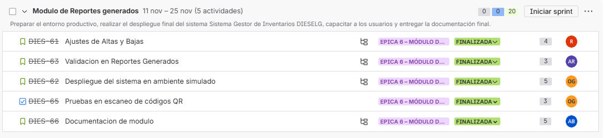
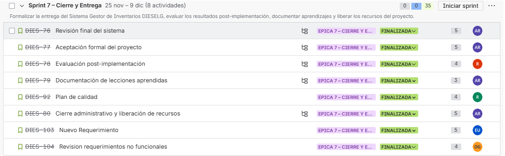
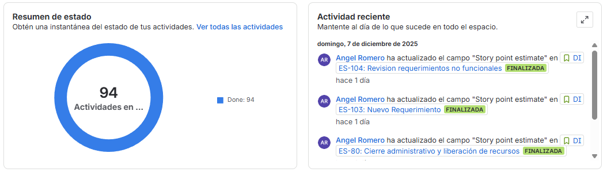
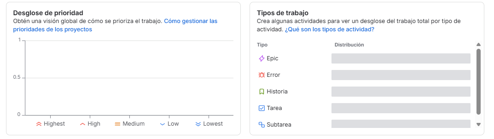
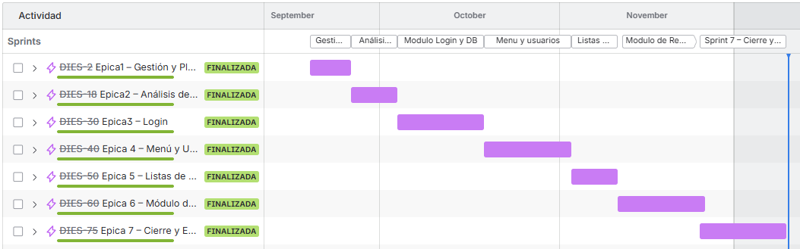

# Instituto Tecnológico de San Juan del Río

**Redes de Computadoras**  
**Actividad Práctica Unidad 4: Cableado Estructurado**

**PRESENTA:**  
Ángel Elías Romero Paulin 22590355  
Ingeniera en sistemas computacionales  
22590355  
Agosto – Diciembre 2025

---

## Bitácora de Cierre de Sprint – Épica 1: Gestión y Planificación

**Proyecto:** Aplicación de Inventarios – Diesel Global  
**Sprint:** Épica 1 – Gestión y Planificación  
**Periodo:** 19-25 de septiembre de 2025  
**Elaborado por:** Angel Elías Romero Paulin

### 1. Introducción

El presente documento tiene como propósito dejar constancia formal del cierre del Sprint correspondiente a la Épica 1: Gestión y Planificación, dentro del marco del proyecto de desarrollo del sistema de inventarios para la empresa Diesel Global. La bitácora presenta un resumen de actividades completadas, responsables, avances obtenidos y cumplimiento de los objetivos establecidos al inicio del Sprint.

### 2. Objetivo del Sprint

Establecer los elementos fundamentales de gestión, planificación y organización necesarios para el desarrollo del proyecto, garantizando claridad en los roles, las responsabilidades, los alcances y los riesgos asociados al proceso de construcción del sistema.

### 3. Actividades Ejecutadas

  

### 4. Resultados Obtenidos

- Se completaron todas las actividades programadas dentro del Sprint.
- Se estableció un marco sólido de gestión documental y organizacional.
- Se formalizó el equipo de trabajo y sus responsabilidades de manera clara.
- Se alcanzó un nivel adecuado de control inicial de riesgos y calidad.
- Se generaron bases sólidas para los siguientes sprints del proyecto.

### 5. Evaluación del Desempeño del Sprint

El equipo alcanzó el cumplimiento del 100 % de las tareas planificadas, cumpliendo los criterios de aceptación y entregando documentación completa y validada. La coordinación y seguimiento fueron adecuados, permitiendo un cierre de Sprint sin impedimentos.

### 6. Lecciones Aprendidas

- La definición temprana de roles facilitó la comunicación interna.
- El acta de constitución proporcionó claridad y alineación sobre los objetivos.
- Resultó útil contar con un registro inicial de riesgos desde el inicio del proyecto.

### 7. Conclusiones

El Sprint correspondiente a la Épica 1 logró cumplir exitosamente sus objetivos fundamentales, sentando las bases metodológicas y estructurales necesarias para el desarrollo futuro del proyecto. La planificación robusta permitirá mayor eficiencia en los siguientes ciclos de trabajo.

---

## Bitácora de Cierre de Sprint – Épica 2: Análisis de Requisitos

**Proyecto:** Aplicación de Inventarios – Diesel Global  
**Sprint:** Épica 2 – Análisis de Requisitos  
**Periodo:** Del 26 de Septiembre al 3 de Octubre 2025  
**Elaborado por:** Angel Elías Romero Paulin

### 1. Introducción

El presente documento registra el cierre formal del Sprint correspondiente a la Épica 2: Análisis de Requisitos, dentro del desarrollo del sistema de inventarios para Diesel Global. En este Sprint se llevaron a cabo actividades orientadas a la recopilación, documentación y validación de los requerimientos necesarios para la correcta construcción del sistema.

### 2. Objetivo del Sprint

Identificar, analizar y documentar de manera detallada los requerimientos funcionales y no funcionales del sistema, así como los procesos actuales, usuarios involucrados y oportunidades de mejora, con el fin de generar una base sólida y validada para el desarrollo posterior del software.

### 3. Actividades Ejecutadas

  

### 4. Resultados Obtenidos

- Se documentaron exitosamente los requerimientos funcionales y no funcionales del sistema.
- Se identificaron los procesos actuales de gestión de inventarios y sus puntos de mejora.
- Se elaboraron diagramas de flujo y casos de uso que clarifican el comportamiento esperado del sistema.
- Se realizaron entrevistas con usuarios clave, obteniendo retroalimentación valiosa para el diseño.
- Se estableció un catálogo completo de requisitos validados con los stakeholders.

### 5. Evaluación del Desempeño del Sprint

El avance general del Sprint fue satisfactorio, logrando un 85% de las tareas planificadas completadas. Las actividades pendientes no afectaron significativamente la continuidad del proyecto y fueron programadas para seguimiento inmediato en el Sprint subsecuente.

### 6. Lecciones Aprendidas

- La participación activa de los usuarios finales facilitó la comprensión profunda de las necesidades reales del sistema.
- La documentación visual mediante diagramas contribuyó a una mejor comunicación entre áreas.
- Es necesario mejorar la gestión de tiempos en actividades de elaboración de documentación extensa para evitar rezagos en los siguientes sprints.

### 7. Conclusiones

El Sprint correspondiente a la Épica 2 se considera exitoso, dado que permitió obtener una base sólida de información y requerimientos que sustentarán la fase de diseño y desarrollo del sistema. Las tareas que quedaron en progreso serán retomadas en el siguiente Sprint sin impacto crítico en la planificación general del proyecto.

---

## Bitácora de Cierre de Sprint – Módulo Login y Base de Datos

**Proyecto:** Aplicación de Inventarios – Diesel Global  
**Sprint:** Módulo Login y DB  
**Periodo:** 4 oct – 18 oct  
**Elaborado por:** Angel Elías Romero Paulin

### 1. Introducción

Este documento presenta el registro formal del cierre del Sprint correspondiente al desarrollo del Módulo de Login y Base de Datos. Este módulo es fundamental, ya que establece la estructura de autenticación y la base de datos que soportará el resto del sistema. El Sprint incluyó actividades de diseño técnico, modelado de base de datos, UX/UI, seguridad y pruebas de validación del acceso.

### 2. Objetivo del Sprint

Diseñar, estructurar y validar el módulo de inicio de sesión y su base de datos asociada, garantizando estándares de seguridad, accesibilidad, arquitectura técnica adecuada y documentación completa que permita continuar con los demás módulos del sistema.

### 3. Actividades Ejecutadas

  

### 4. Resultados Obtenidos

- Se completó el diseño integral del módulo de login y su base de datos.
- Se generaron prototipos UX/UI funcionales y validados.
- Se establecieron mecanismos de seguridad alineados con buenas prácticas.
- Se documentó todo el módulo, permitiendo su integración con otros componentes del sistema.
- Todas las actividades planificadas fueron cerradas al 100%.

### 5. Evaluación del Desempeño del Sprint

El Sprint se considera exitoso, logrando un cumplimiento total de tareas y alcanzando todos los objetivos planteados. La colaboración entre diseñadores, arquitectos, analistas y validadores fue eficiente, evitando impedimentos y manteniendo el flujo de trabajo continuo.

### 6. Lecciones Aprendidas

- La definición temprana de la arquitectura permitió un desarrollo estructurado y sin bloqueos.
- Las pruebas tempranas del login evitaron problemas futuros de integración.
- La colaboración entre UX y backend agilizó la creación de un flujo más intuitivo.
- Incluir pruebas de seguridad desde la primera iteración fortaleció el diseño del módulo.

### 7. Conclusiones

Este Sprint cimentó una parte esencial del sistema: la autenticación y su almacenamiento seguro. La finalización exitosa de todas las tareas permite avanzar sin contratiempos hacia los siguientes módulos del proyecto, con una base sólida tanto técnica como documental.

---

## Bitácora de Cierre de Sprint – Módulo Menú y Usuarios

**Proyecto:** Aplicación de Inventarios – Diesel Global  
**Sprint:** Menú y Usuarios  
**Periodo:** 19 oct – 2 nov  
**Elaborado por:** Angel Elías Romero Paulin

### 1. Introducción

Esta bitácora registra el cierre del Sprint dedicado al desarrollo del Módulo de Menú y Gestión de Usuarios. Este módulo integra funcionalidades esenciales del sistema, como la interfaz del menú principal, la asignación de roles, el backend correspondiente y las pruebas necesarias para garantizar su correcto funcionamiento. El objetivo principal del Sprint fue construir y validar la estructura funcional de navegación y control de usuarios del sistema.

### 2. Objetivo del Sprint

Desarrollar e integrar los componentes de frontend y backend relacionados con el menú principal y la gestión de usuarios, asegurando una comunicación adecuada entre módulos, el cumplimiento de roles establecidos y la correcta funcionalidad mediante pruebas unitarias y validaciones.

### 3. Actividades Ejecutadas

  

### 4. Resultados Obtenidos

- El módulo de navegación principal quedó completamente funcional y alineado con los requisitos del sistema.
- Se desarrollaron los componentes del backend y frontend para la gestión de usuarios.
- El sistema ahora cuenta con roles funcionales (administrador y capturista) correctamente implementados.
- Las pruebas automatizadas confirmaron el funcionamiento estable del módulo.
- Se generó la documentación técnica necesaria para futuras implementaciones o mantenimientos.
- Se alcanzó el 100% de las actividades planificadas.

### 5. Evaluación del Desempeño del Sprint

El desempeño del equipo fue altamente satisfactorio. Se logró la integración completa entre los elementos de backend, frontend y seguridad asociados al menú y usuarios. No se presentaron incidencias que afectaran el avance del Sprint, lo que permitió finalizarlo en tiempo y forma.

### 6. Lecciones Aprendidas

- El análisis previo de roles facilitó la asignación correcta de permisos y accesos.
- La integración temprana de frontend y backend permitió detectar errores rápidamente.
- Las pruebas automatizadas redujeron significativamente el tiempo de validación manual.
- Mantener una documentación actualizada aceleró la comprensión entre los miembros del equipo.

### 7. Conclusiones

La finalización del Sprint correspondiente al módulo de Menú y Usuarios representa un avance significativo en la arquitectura funcional del sistema. El módulo quedó correctamente integrado, probado y documentado, sentando bases sólidas para el desarrollo de módulos subsecuentes como inventarios, embarques y reportes. El cumplimiento total del Sprint confirma un trabajo eficiente y coordinado entre las distintas áreas del equipo.

---

## Bitácora de Cierre de Sprint – Listas de Inventarios (Altas y Bajas)

**Proyecto:** Aplicación de Inventarios – Diesel Global  
**Sprint:** Listas de Inventarios AyB  
**Periodo:** 3 nov – 10 nov  
**Responsable del Sprint:** Ángel Elías Romero Paulín

### 1. Introducción

La presente bitácora documenta el cierre del Sprint enfocado en las Listas de Inventarios de Altas y Bajas, módulo esencial del sistema DISEGLOB, responsable de garantizar el control del inventario y la trazabilidad de cada movimiento. Este Sprint cubrió pruebas unitarias, integración entre módulos, corrección de errores, validación con usuarios y documentación técnica.

### 2. Objetivo del Sprint

Asegurar la calidad técnica y funcional del módulo de Inventarios AyB mediante la ejecución de pruebas exhaustivas (unitarias, de integración y de aceptación), la corrección de errores detectados y la documentación completa del módulo previo a su implementación.

### 3. Actividades Ejecutadas

  

### 4. Resultados Obtenidos

- El módulo de Altas y Bajas de inventarios quedó completamente validado y en correcto funcionamiento.
- Se confirmó la estabilidad del sistema mediante pruebas unitarias, de integración y de aceptación.
- Se detectaron y corrigieron errores críticos y menores, garantizando una operación fluida.
- Los usuarios finales aprobaron la funcionalidad del módulo.
- Se realizó la conexión final a la BD y se verificó la manipulación correcta de datos.
- La documentación final del módulo quedó lista para implementación y mantenimiento.

### 5. Evaluación del Desempeño del Sprint

El Sprint se ejecutó con un 100% de cumplimiento, logrando finalizar todas las actividades dentro del periodo establecido. La calidad del módulo aumentó significativamente tras las pruebas y correcciones aplicadas. El desempeño del Sprint se considera altamente satisfactorio.

### 6. Lecciones Aprendidas

- La detección temprana de errores mediante pruebas unitarias reduce tiempos posteriores de depuración.
- Las pruebas de aceptación con usuarios aportan un valor crítico en la verificación del flujo real de trabajo.
- Mantener una conexión estable con la base de datos desde el inicio agiliza la validación de datos.
- La documentación generada facilita futuras fases de mantenimiento y mejoras.

### 7. Conclusiones

El Sprint de Listas de Inventarios AyB consolidó un módulo robusto, probado y estable, listo para integrarse al flujo principal del sistema. Con el módulo completamente documentado y validado, el proyecto avanza con una base sólida hacia las siguientes funcionalidades.

---

## Bitácora de Cierre de Sprint – Módulo de Reportes Generados

**Proyecto:** Aplicación de Inventarios – Diesel Global  
**Sprint:** Módulo de Reportes Generados  
**Periodo:** 11 nov – 25 nov  
**Responsable del Sprint:** [Indicar responsable general si aplica]

### 1. Introducción

Esta bitácora documenta el cierre del Sprint enfocado en el Módulo de Reportes Generados del sistema DISEGLOB. Este módulo comprende la generación, validación y ajuste de reportes, así como pruebas complementarias con tecnologías complementarias (como lectura de códigos QR), asegurando que el sistema pueda generar información confiable para la toma de decisiones en el entorno operativo de Diesel Global.

### 2. Objetivo del Sprint

Preparar el entorno para el despliegue productivo, validar la correcta generación de reportes, realizar pruebas de integración en ambiente simulado, garantizar la funcionalidad del escaneo QR y documentar el módulo previo a la entrega final.

### 3. Actividades Ejecutadas

  

### 4. Resultados Obtenidos

- Los reportes fueron validados y se comprobó su precisión en distintos escenarios de uso.
- El entorno simulado permitió detectar y corregir detalles previos al despliegue productivo.
- Se logró la correcta integración de la funcionalidad de escaneo QR con los reportes.
- La información generada por el sistema coincide con los datos reales de inventario.
- El módulo quedó completamente documentado para su mantenimiento e implementación final.
- Todas las actividades del Sprint se completaron al 100%.

### 5. Evaluación del Desempeño del Sprint

El Spring mostró un rendimiento óptimo, cumpliendo con la totalidad de las tareas asignadas dentro del plazo estipulado. La validación de reportes y las pruebas de integración se ejecutaron sin bloqueos significativos, permitiendo avanzar hacia la fase de despliegue final del sistema.

### 6. Lecciones Aprendidas

- Validar reportes con datos reales minimiza errores en producción.
- El ambiente simulado resulta esencial para asegurar un comportamiento estable del sistema.
- La funcionalidad QR amplía la eficiencia del inventario y requiere pruebas detalladas.
- La documentación al día facilita la adopción del sistema por parte de nuevos usuarios.

### 7. Conclusiones

El Sprint dedicado al Módulo de Reportes Generados concluyó exitosamente, dejando un módulo estable, validado, documentado y listo para el despliegue productivo. Este avance marca la fase final del proyecto, asegurando que la información crítica del inventario sea confiable, accesible y exacta.

---

## Bitácora de Cierre de Sprint – Sprint 7: Cierre y Entrega

**Proyecto:** Sistema Gestor de Inventarios DISEGLOB – Diesel Global  
**Sprint:** 7 – Cierre y Entrega  
**Periodo:** 25 noviembre – 9 diciembre  
**Responsable General del Sprint:** Ángel Elías Romero Paulín

### 1. Introducción

El Sprint 7 representa la fase final del proyecto, centrada en formalizar la entrega del Sistema Gestor de Inventarios DISEGLOB, evaluar el desempeño del sistema tras su implementación inicial, documentar los aprendizajes del proyecto, revisar requerimientos finales y llevar a cabo el cierre administrativo. Esta bitácora describe el cumplimiento de las actividades planificadas, los resultados obtenidos y conclusiones generales del cierre del proyecto.

### 2. Objetivo del Sprint

Garantizar el cierre formal y ordenado del proyecto mediante la revisión final del sistema, aceptación del cliente, evaluación post-implementación, documentación de lecciones aprendidas, elaboración del plan de calidad y liberación de recursos, así como atender requerimientos finales identificados durante la fase final.

### 3. Actividades Ejecutadas

  

### 4. Resultados Obtenidos

- Se verificó que el sistema cumple completamente con los requerimientos establecidos.
- El cliente otorgó la aceptación formal del proyecto, confirmando la satisfacción con el producto final.
- Se obtuvo retroalimentación positiva durante la evaluación post–implementación.
- Se documentaron las lecciones aprendidas, promoviendo la mejora continua del equipo.
- Se formalizó el plan de calidad del proyecto, consolidando evidencias y procesos.
- Se realizó exitosamente el cierre administrativo del proyecto.
- Se atendieron requerimientos adicionales sin impactos negativos.
- Se confirmó el cumplimiento total de los requisitos no funcionales.
- El Sprint culminó con un 100% de actividades finalizadas.

### 5. Evaluación del Desempeño del Sprint

El desempeño del equipo durante este Sprint fue altamente satisfactorio. La organización, documentación y comunicación permitieron cerrar el proyecto de forma ordenada, sin retrasos y cumpliendo con todos los estándares de calidad. El sistema fue entregado en funcionamiento óptimo y validado en su totalidad.

### 6. Lecciones Aprendidas

- La validación continua en cada sprint facilita un cierre eficiente y sin retrabajos.
- La documentación progresiva del proyecto reduce tiempos en la fase final.
- La retroalimentación temprana de usuarios mejora la calidad del producto.
- Los controles de calidad aplicados durante el proyecto evitaron defectos críticos en producción.
- La planificación detallada del cierre administrativo agilizó la liberación de recursos.

### 7. Conclusiones

El Sprint 7 marca la conclusión exitosa del proyecto DISEGLOB. El sistema fue revisado, validado, aceptado y documentado conforme a estándares profesionales. Con este Sprint se formaliza la entrega del sistema a Diesel Global, cerrando el ciclo de desarrollo e iniciando su etapa de operación y mantenimiento. El cumplimiento total de actividades y la satisfacción del cliente confirman el éxito del proyecto.

---

## INFORME FINAL DE CIERRE DEL PROYECTO

**Proyecto:** Sistema Gestor de Inventarios DISEGLOB  
**Empresa:** Diesel Global  
**Periodo de ejecución:** Septiembre – Diciembre  
**Responsable General del Proyecto:** Ángel Elías Romero Paulín  
**Equipo:** Diseño, Desarrollo, QA, Documentación, Análisis y Testing

### 1. Resumen Ejecutivo del Proyecto

El proyecto Sistema Gestor de Inventarios DISEGLOB concluyó exitosamente, cumpliendo con todas las fases planificadas bajo la metodología ágil. Se completaron 94 actividades, cubriendo diseño, desarrollo, análisis, pruebas, documentación y despliegue final del sistema.

El resultado es un sistema funcional, probado, documentado y aceptado formalmente por el cliente. Todas las épicas y sus respectivos sprints fueron concluidos dentro del periodo establecido.

### 2. Estado Global del Proyecto

- **Actividades totales:** 94
- **Actividades completadas:** 94
- **Porcentaje de cumplimiento:** 100%
- **Incidencias críticas:** Ninguna pendiente
- **Estado final:** PROYECTO COMPLETADO Y ENTREGADO

El panel de estado refleja una finalización total sin tareas abiertas, lo que valida el cierre del proyecto sin rezagos.

### 3. Línea del Tiempo del Proyecto (Gantt)

  

  

  

### 4. Actividad Reciente y Control del Proyecto

La actividad reciente confirma el cierre de:

- Revisión de requisitos no funcionales
- Requerimientos nuevos
- Cierre administrativo
- Liberación de recursos

Esto coincide con el cierre formal del Sprint 7 y marca el final del proyecto.

### 5. Distribución del Trabajo por Tipo

De acuerdo con los paneles del sistema:

- **Épicas completadas:** 7
- **Tareas:** Mayor proporción del trabajo total
- **Historias & Subtareas:** Utilizadas para desglose técnico y pruebas
- **Errores:** Minimales y resueltos durante los sprints correspondientes

La distribución refleja un proyecto técnicamente bien estructurado y controlado.

### 6. Evaluación Final del Proyecto

#### 6.1 Cumplimiento

- ✔ Objetivos funcionales logrados
- ✔ Integración de todos los módulos
- ✔ Roles diferenciados y control de accesos
- ✔ Pruebas unitarias, de integración y aceptación exitosas
- ✔ Documentación completa del sistema
- ✔ Aceptación formal del cliente

#### 6.2 Calidad

- ✔ Cumplimiento de requisitos no funcionales
- ✔ Desempeño estable en ambiente simulado y real
- ✔ Optimización del sistema previo a despliegue
- ✔ Plan de calidad documentado

#### 6.3 Gestión

- ✔ Sprints ejecutados sin retrasos significativos
- ✔ Equipo coordinado en funciones multidisciplinares
- ✔ Control total de actividades
- ✔ Entrega final dentro del calendario establecido

### 7. Lecciones Aprendidas Globales

- La documentación continua agiliza el cierre del proyecto.
- La validación temprana de módulos evita errores en fases avanzadas.
- La comunicación constante con stakeholders mejora la precisión del producto final.
- La definición temprana de roles y permisos evita re-trabajos en seguridad.
- La integración periódica del sistema reduce riesgos de incompatibilidad.

### 8. Conclusión General del Proyecto

El Sistema Gestor de Inventarios DISEGLOB ha sido entregado exitosamente, validado por usuarios, documentado formalmente y aceptado por el cliente. El proyecto concluye con:

- 100% de actividades completadas
- 7 épicas finalizadas
- Entrega formal y cierre administrativo
- Sistema funcional, estable y listo para operación

El resultado final cumple plenamente con los objetivos estratégicos de Diesel Global y sienta las bases para futuras mejoras y crecimiento tecnológico.